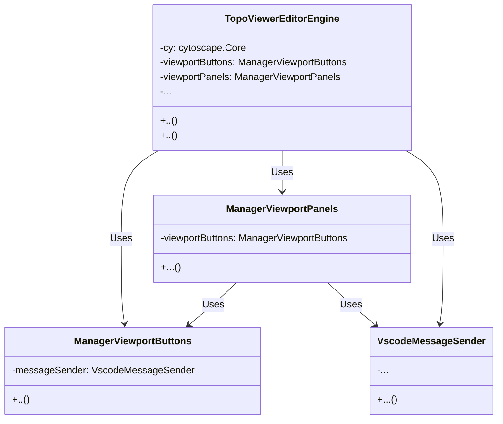

# TopoViewerEditor: An Add-On to the Containerlab VS Code Extension

Welcome to TopoViewerEditor, an add-on for the existing Containerlab VS Code Extension that provides an interactive, web-based interface for visualizing and editing Containerlab topologies. This document gives a concise overview of TopoViewerEditor's structure, how it works, and how to get started.

## Project Structure

The project is organized as following key component:

```
.
├── backend
│   └── topoViewerEditorWebUiFacade.ts
│   └── ../src/topoViewer/topoViewerAdaptorClab.ts ## reusing TopoViewer class
├── file_list_with_content.txt
└── webview-ui
    ├── managerCytoscapeFetchAndLoad.ts
    ├── managerCytoscapeStyle.ts
    ├── managerViewportButtons.ts
    ├── managerViewportPanels.ts
    ├── managerVscodeWebview.ts
    ├── template
    │   └── vscodeHtmlTemplate.ts
    └── topoViewerEditorEngine.ts
```

## Key Components

### Backend

- **`topoViewerEditorWebUiFacade.ts`**: This file contains the `TopoViewerEditor` class, which is responsible for creating and managing the webview panel that displays the Cytoscape graph. It handles the creation of YAML templates, validation of YAML content, and updating the webview panel with the latest topology data.

### Webview UI

The Webview UI consists of several key classes that interact with each other to provide a seamless user experience. Below is a simplified class interaction diagram:



- **`managerCytoscapeFetchAndLoad.ts`**: Manages fetching and loading data into the Cytoscape instance. It includes functions to fetch data from JSON files and process it for visualization.
- **`managerCytoscapeStyle.ts`**: Defines the styles for Cytoscape elements, including nodes and edges. It also includes functions to generate encoded SVG strings for different node types.
- **`managerViewportButtons.ts`**: Handles the functionality related to viewport button actions, such as saving the current topology, zooming to fit, toggling endpoint labels, reloading the topology, and adding new Containerlab nodes.
- **`managerViewportPanels.ts`**: Manages the UI panels associated with the Cytoscape viewport. It includes functionality for displaying node and edge editor panels, updating node properties, and handling panel toggles.
- **`managerVscodeWebview.ts`**: Manages communication between the webview and the VS Code extension backend. It sends messages to the extension and listens for responses.
- **`topoViewerEditorEngine.ts`**: The main engine for the topology editor webview. It initializes the Cytoscape instance, manages edge creation, node editing, and viewport panels/buttons.
- **`template/vscodeHtmlTemplate.ts`**: Contains the HTML template for the webview, which includes the structure and layout of the webview UI.

## Getting Started

To get started with TopoViewer, follow these steps:

1. **Installation**: Ensure you have the Containerlab VS Code Extension installed. TopoViewer is designed to work as an add-on to this extension.
2. **Usage**: Open a Containerlab topology file in VS Code. The TopoViewer interface will provide an interactive visualization of the topology.
3. **Interactive Features**:
   - **Node and Edge Editing**: Click on nodes and edges to edit their properties.
   - **Containerlab Editor**: Enable the Containerlab editor to make changes to the topology.

## Development

To contribute to TopoViewer, follow these guidelines:

1. **Code Structure**: Familiarize yourself with the project structure and key components.
2. **Coding Standards**: Follow the existing coding standards and practices used in the project.
3. **Testing**: Ensure that any new features or changes are thoroughly tested.

## License

TopoViewer is licensed under the [MIT License](LICENSE).